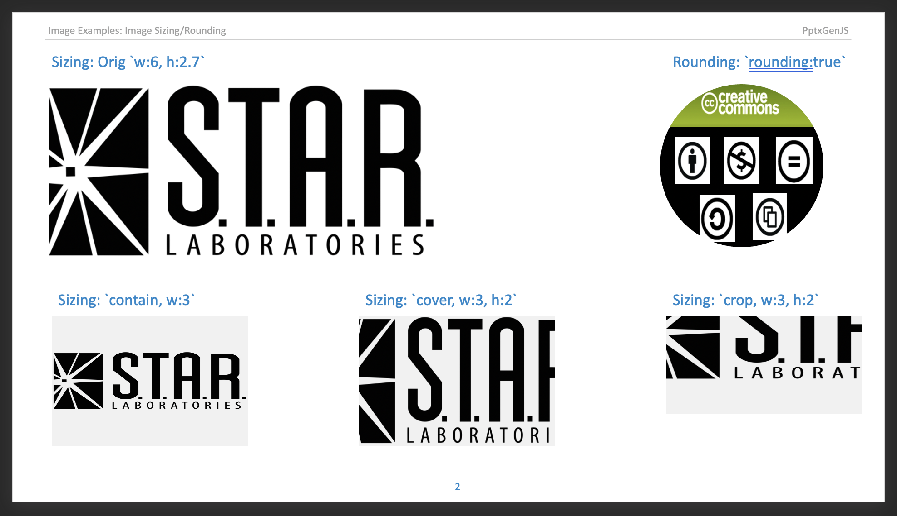

Images of almost any type can be added to Slides.

## Usage Example

```javascript
// Image from remote URL
slide.addImage({ path: "https://upload.wikimedia.org/wikipedia/en/a/a9/Example.jpg" });

// Image by local URL
slide.addImage({ path: "images/chart_world_peace_near.png" });

// Image by data (pre-encoded base64)
slide.addImage({ data: "image/png;base64,iVtDafDrBF[...]=" });
```

## Usage Notes

Either provide a URL location or base64 data to create an image.

-   `path` - URL: relative or full
-   `data` - base64: string representing an encoded image

## Supported Formats and Notes

-   Standard image types: png, jpg, gif, et al.
-   Animated gifs: only shown animated on Microsoft 365/Office365 and the newest desktop versions, older versions will animate them in presentation mode only
-   SVG images: supported in the newest version of desktop PowerPoint or Microsoft 365/Office365

## Performance Considerations

It takes CPU time to read and encode images! The more images you include and the larger they are, the more time will be consumed.

-   The time needed to read/encode images can be completely eliminated by pre-encoding any images
-   Pre-encode images into a base64 strings and use the `data` option value instead
-   This will both reduce dependencies (who needs another image asset to keep track of?) and provide a performance
    boost (no time will need to be consumed reading and encoding the image)

## Properties

### Position/Size Props ([PositionProps](/PptxGenJS/docs/types#position-props))

| Option | Type   | Default | Description            | Possible Values                              |
| :----- | :----- | :------ | :--------------------- | :------------------------------------------- |
| `x`    | number | `1.0`   | hor location (inches)  | 0-n                                          |
| `x`    | string |         | hor location (percent) | 'n%'. (Ex: `{x:'50%'}` middle of the Slide)  |
| `y`    | number | `1.0`   | ver location (inches)  | 0-n                                          |
| `y`    | string |         | ver location (percent) | 'n%'. (Ex: `{y:'50%'}` middle of the Slide)  |
| `w`    | number | `1.0`   | width (inches)         | 0-n                                          |
| `w`    | string |         | width (percent)        | 'n%'. (Ex: `{w:'50%'}` 50% the Slide width)  |
| `h`    | number | `1.0`   | height (inches)        | 0-n                                          |
| `h`    | string |         | height (percent)       | 'n%'. (Ex: `{h:'50%'}` 50% the Slide height) |

### Data/Path Props ([DataOrPathProps](/PptxGenJS/docs/types#datapath-props-dataorpathprops))

| Option | Type   | Default | Description         | Possible Values                                                            |
| :----- | :----- | :------ | :------------------ | :------------------------------------------------------------------------- |
| `data` | string |         | image data (base64) | base64-encoded image string. (either `data` or `path` is required)         |
| `path` | string |         | image path          | Same as used in an (img src="") tag. (either `data` or `path` is required) |

### Image Props ([ImageProps](/PptxGenJS/docs/types#image-props-imageprops))

| Option        | Type                                                                        | Default | Description        | Possible Values                        |
| :------------ | :-------------------------------------------------------------------------- | :------ | :----------------- | :------------------------------------- |
| `hyperlink`   | [HyperlinkProps](/PptxGenJS/docs/types#hyperlink-props-hyperlinkprops) |         | add hyperlink      | object with `url` or `slide`           |
| `placeholder` | string                                                                      |         | image placeholder  | Placeholder location: `title`, `body`  |
| `rotate`      | integer                                                                     | `0`     | rotation (degrees) | Rotation degress: `0`-`359`            |
| `rounding`    | boolean                                                                     | `false` | image rounding     | Shapes an image into a circle          |
| `sizing`      | object                                                                      |         | transforms image   | See [Image Sizing](#sizing-properties) |

## Sizing Properties

The `sizing` option provides cropping and scaling an image to a specified area. The property expects an object with the following structure:

| Property | Type   | Unit   | Default          | Description                                   | Possible Values                    |
| :------- | :----- | :----- | :--------------- | :-------------------------------------------- | :--------------------------------- |
| `type`   | string |        |                  | sizing algorithm                              | `'crop'`, `'contain'` or `'cover'` |
| `w`      | number | inches | `w` of the image | area width                                    | 0-n                                |
| `h`      | number | inches | `h` of the image | area height                                   | 0-n                                |
| `x`      | number | inches | `0`              | area horizontal position related to the image | 0-n (effective for `crop` only)    |
| `y`      | number | inches | `0`              | area vertical position related to the image   | 0-n (effective for `crop` only)    |

### Sizing Types

-   `contain` works as CSS property `background-size` — shrinks the image (ratio preserved) to the area given by `w` and `h` so that the image is completely visible. If the area's ratio differs from the image ratio, an empty space will surround the image.
-   `cover` works as CSS property `background-size` — shrinks the image (ratio preserved) to the area given by `w` and `h` so that the area is completely filled. If the area's ratio differs from the image ratio, the image is centered to the area and cropped.
-   `crop` cuts off a part specified by image-related coordinates `x`, `y` and size `w`, `h`.

### Sizing Notes

-   If you specify an area size larger than the image for the `contain` and `cover` type, then the image will be stretched, not shrunken.
-   In case of the `crop` option, if the specified area reaches out of the image, then the covered empty space will be a part of the image.
-   When the `sizing` property is used, its `w` and `h` values represent the effective image size. For example, in the following snippet, width and height of the image will both equal to 2 inches and its top-left corner will be located at [1 inch, 1 inch]:

### Sizing Example

-   See `demos/common/demos.js` for complete examples


