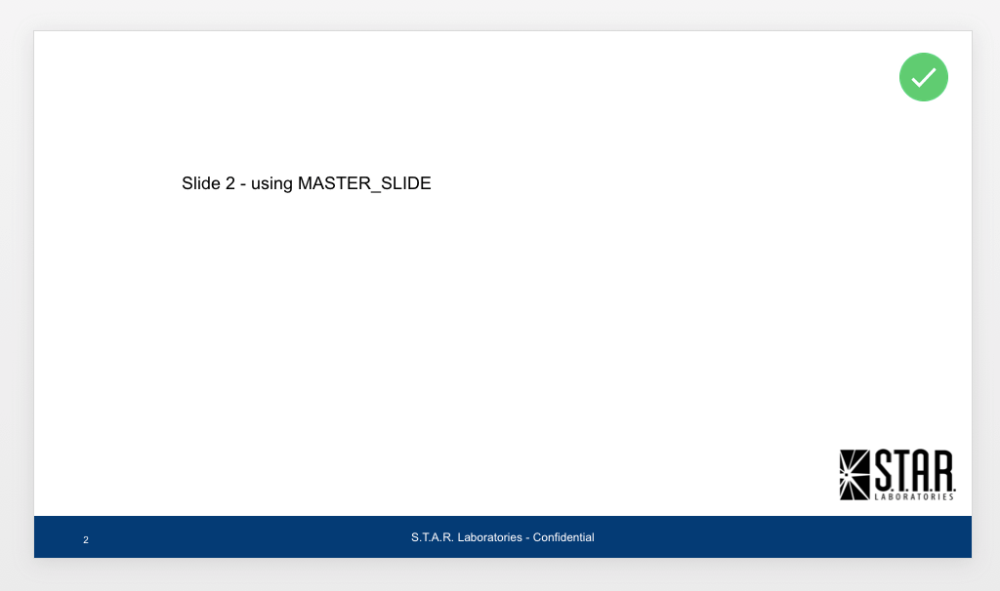
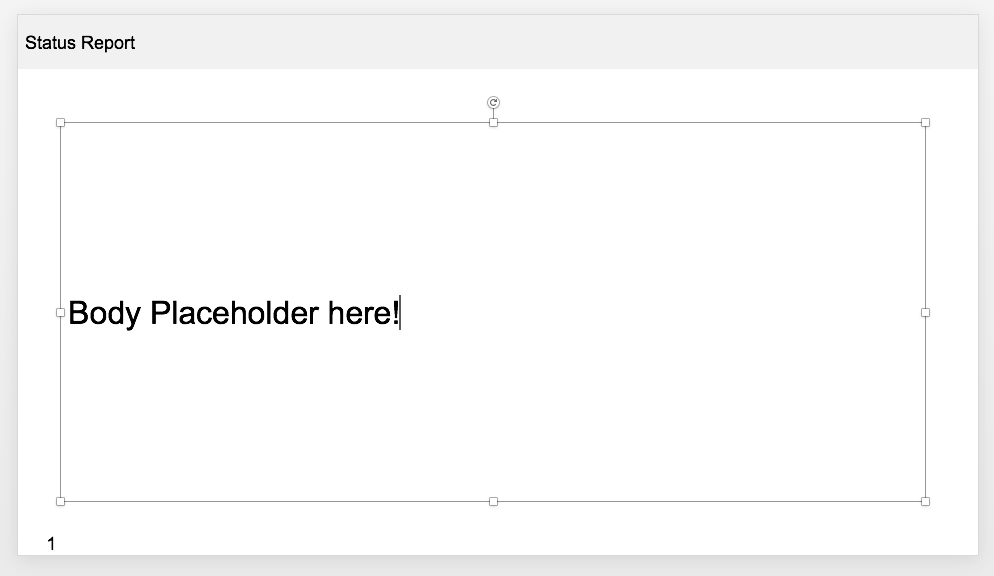

## Slide Masters

Generating sample slides like those shown in the Examples section are great for demonstrating library features,
but the reality is most of us will be required to produce presentations that have a certain design or
corporate branding.

PptxGenJS allows you to define Slide Master Layouts via objects that can then be used to provide branding
functionality. This enables you to easily create a Master Slide using code.

Slide Masters are created by calling the `defineSlideMaster()` method along with an options object
(same style used in Slides). Once defined, you can pass the Master title to `addSlide()` and that Slide will
use the Layout previously defined. See the demo under /examples for several working examples.

The defined Masters become first-class Layouts in the exported PowerPoint presentation and can be changed
via View > Slide Master and will affect the Slides created using that layout.

## Properties

### Slide Master Props (`SlideMasterProps`)

| Option        | Type             | Reqd? | Description       | Possible Values                                                       |
| :------------ | :--------------- | :---- | :---------------- | --------------------------------------------------------------------- |
| `title`       | string           | Y     | Layout title/name | unique name for this Master                                           |
| `background`  | BackgroundProps  |       | background props  | (see [Background Props](#background-props-backgroundprops))           |
| `margin`      | number           |       | Slide margins     | (inches) 0.0 through Slide.width                                      |
| `margin`      | array            |       | Slide margins     | (inches) array of numbers in TRBL order. Ex: `[0.5, 0.75, 0.5, 0.75]` |
| `objects`     | array            |       | Objects for Slide | object with type and options. [Example](/PptxGenJS/demo/#templates)   |
| `slideNumber` | SlideNumberProps |       | Slide numbers     | (see [SlideNumber Props](#slidenumber-props-slidenumberprops))        |

### Background Props (`BackgroundProps`)

| Option         | Type   | Default  | Description  | Possible Values                                                                                           |
| :------------- | :----- | :------- | :----------- | :-------------------------------------------------------------------------------------------------------- |
| `color`        | string | `000000` | color        | hex color code or [scheme color constant](/PptxGenJS/docs/shapes-and-schemes). Ex: `{line:'0088CC'}` |
| `transparency` | number | `0`      | transparency | Percentage: 0-100                                                                                         |

### SlideNumber Props (`SlideNumberProps`)

| Option  | Type   | Default  | Description                  | Possible Values                                                                                           |
| :------ | :----- | :------- | :--------------------------- | :-------------------------------------------------------------------------------------------------------- |
| `x`     | number | `1.0`    | horizontal location (inches) | 0-n OR 'n%'. (Ex: `{x:'50%'}` will place object in the middle of the Slide)                               |
| `y`     | number | `1.0`    | vertical location (inches)   | 0-n OR 'n%'.                                                                                              |
| `w`     | number |          | width (inches)               | 0-n OR 'n%'. (Ex: `{w:'50%'}` will make object 50% width of the Slide)                                    |
| `h`     | number |          | height (inches)              | 0-n OR 'n%'.                                                                                              |
| `align` | string | `left`   | alignment                    | `left` or `center` or `right`                                                                             |
| `color` | string | `000000` | color                        | hex color code or [scheme color constant](/PptxGenJS/docs/shapes-and-schemes). Ex: `{line:'0088CC'}` |

**NOTES**

-   Slide Number: more props are available that shown above - `SlideNumberProps` inherits from [TextProps](/PptxGenJS/docs/api-text.html)
-   Pre-encode your images (base64) and add the string as the optional data key/val (see `bkgd` above)

## Examples

### Slide Master Example

```javascript
let pptx = new PptxGenJS();
pptx.layout = "LAYOUT_WIDE";

pptx.defineSlideMaster({
    title: "MASTER_SLIDE",
    background: { color: "FFFFFF" },
    objects: [
        { line: { x: 3.5, y: 1.0, w: 6.0, line: { color: "0088CC", width: 5 } } },
        { rect: { x: 0.0, y: 5.3, w: "100%", h: 0.75, fill: { color: "F1F1F1" } } },
        { text: { text: "Status Report", options: { x: 3.0, y: 5.3, w: 5.5, h: 0.75 } } },
        { image: { x: 11.3, y: 6.4, w: 1.67, h: 0.75, path: "images/logo.png" } },
    ],
    slideNumber: { x: 0.3, y: "90%" },
});

let slide = pptx.addSlide({ masterName: "MASTER_SLIDE" });
slide.addText("How To Create PowerPoint Presentations with JavaScript", { x: 0.5, y: 0.7, fontSize: 18 });

pptx.writeFile();
```

### Slide Master Example Output

Using the 'MASTER_SLIDE' defined above to produce a Slide:


## Placeholders

Placeholders are supported in PptxGenJS.

Add a `placeholder` object to a Master Slide using a unique name, then reference that placeholder
name when adding text or other objects.

### Placeholder Types

| Type    | Description |
| :------ | :---------- |
| `title` | slide title |
| `body`  | body area   |
| `image` | image       |
| `chart` | chart       |
| `table` | table       |
| `media` | audio/video |

### Placeholder Example

```javascript
let pptx = new PptxGenJS();
pptx.layout = "LAYOUT_WIDE";

pptx.defineSlideMaster({
    title: "PLACEHOLDER_SLIDE",
    background: { color: "FFFFFF" },
    objects: [
        { rect: { x: 0, y: 0, w: "100%", h: 0.75, fill: { color: "F1F1F1" } } },
        { text: { text: "Status Report", options: { x: 0, y: 0, w: 6, h: 0.75 } } },
        {
            placeholder: {
                options: { name: "body", type: "body", x: 0.6, y: 1.5, w: 12, h: 5.25 },
                text: "(custom placeholder text!)",
            },
        },
    ],
    slideNumber: { x: 0.3, y: "95%" },
});

let slide = pptx.addSlide({ masterName: "PLACEHOLDER_SLIDE" });

// Add text, charts, etc. to any placeholder using its `name`
slide.addText("Body Placeholder here!", { placeholder: "body" });

pptx.writeFile();
```

### Placeholder Example Output

Using the 'PLACEHOLDER_SLIDE' defined above to produce a Slide:


## More Examples and Demos

There are several Master Slides defined in the Demo: `demos/browser/index.html` including examples using placeholders.

